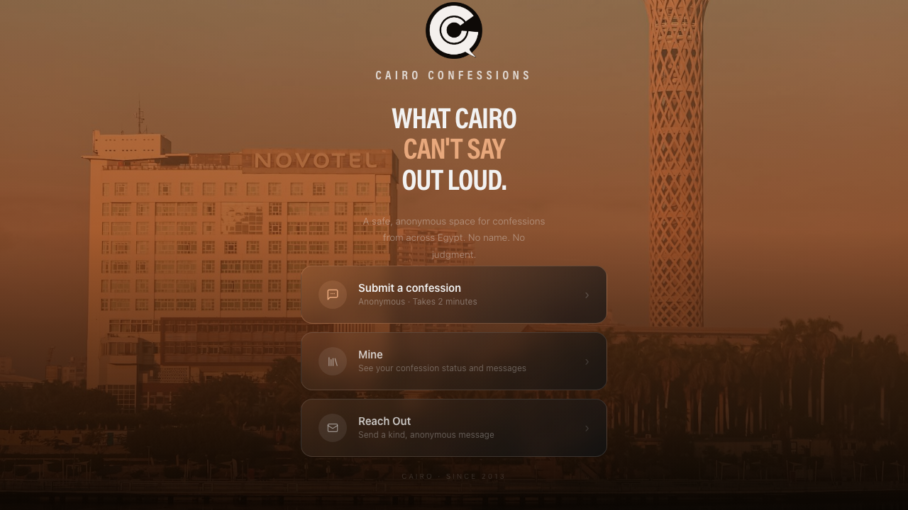
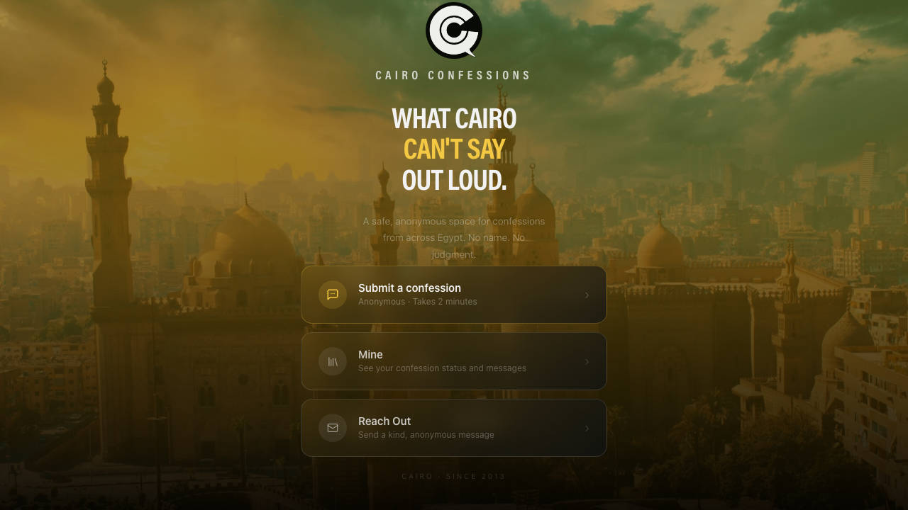
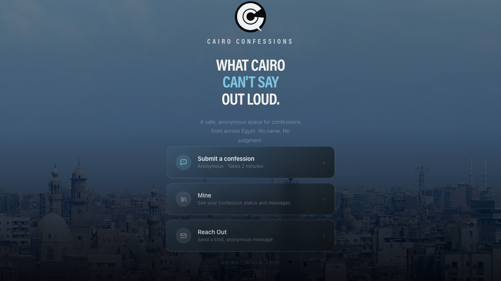
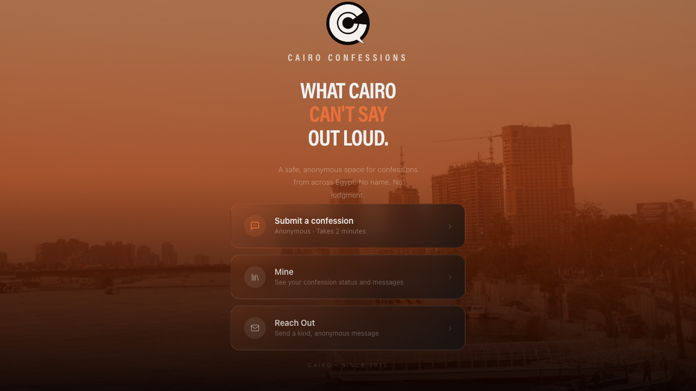
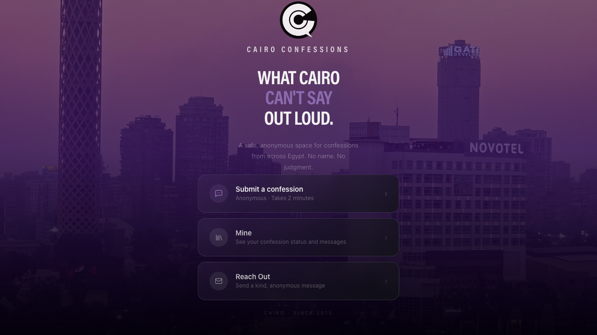
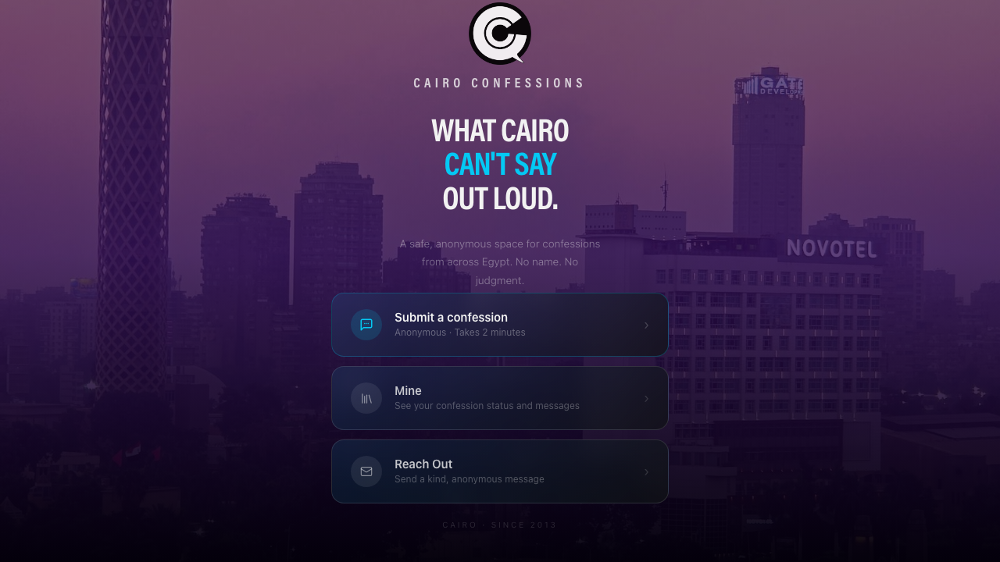

<div align="center">


<h1>Cairo Confessions — App V1</h1>

**What Cairo can't say out loud.**

[](https://app.cairoconfessions.com)
[](https://workers.cloudflare.com)
[](https://tanstack.com/start)
[](/)

[Live App](https://app.cairoconfessions.com) · [Main Site](https://www.cairoconfessions.com) · [Architecture](../Specs/SYSTEM-ARCHITECTURE.md) · [Session Log](SESSION_LOG.md)

</div>

---

A safe, anonymous platform for the Cairo Confessions community. Submit confessions, track their status, and connect — no account, no name, no judgment. Identity is device-local and session-based.

---

## Screenshots

The UI shifts with Cairo's time of day — 6 phases, each with its own palette and atmosphere.

<div align="center">

| Dawn | Morning | Midday |
|:----:|:-------:|:------:|
|  |  |  |
| **Sunset** | **Dusk** | **Night** |
|  |  |  |

</div>

---

## Stack

| Layer | Tech |
|---|---|
| Framework | TanStack Start (React 19 SSR) |
| Router | TanStack Router |
| Styling | Tailwind CSS v4 + phase-aware CSS vars |
| Animations | Framer Motion |
| Backend | Google Apps Script (confession intake + sessions DB) |
| Hosting | Cloudflare Workers |
| Build | Vite + `npm run build` + `wrangler deploy` |

---

## Routes

| Route | Purpose | Status |
|---|---|---|
| `/` | Landing — 3 CTAs | ✅ Live |
| `/confess-here` | Chat-style anonymous confession intake | ✅ Live |
| `/track` | Track all confessions — status, detail, recovery | ✅ Live |
| `/reach` | Community threads | ⏳ Shell only |
| `/login` | Recovery login (token-based) | ✅ Live |

---

## Getting Started

```bash
git clone https://github.com/mohamedallam13/cairo-confessions-app
cd cairo-confessions-app
npm install
```

Create `.dev.vars` in the root (never commit):
```
CC_INTAKE_URL=https://script.google.com/macros/s/AKfycbwryGJTL2NK-.../exec
CC_INTAKE_TOKEN=your_token_here
```

```bash
npm run dev
```

> ⚠️ Navigate via home page links only — direct URL navigation causes SSR errors in dev.

---

## Deploy

Always build and deploy together — hashes must match:

```bash
npm run build && npx wrangler deploy
```

> ⚠️ Never run `wrangler deploy` without rebuilding first. The server entry references hashed chunk filenames — a stale deploy causes a 500.

Secrets are stored in Cloudflare (set once, persist across deploys):
```bash
npx wrangler secret put CC_INTAKE_URL
npx wrangler secret put CC_INTAKE_TOKEN
```

---

## Architecture

```
Browser (localStorage)
  cc_anon_id          ← anonymous identity, generated once per device
  cc_my_refs          ← all refNums submitted from this device
  cc_ingesting        ← refs with in-flight GAS writes
  cc_status_cache     ← polled status per ref (30min TTL)
  cc_card_cache       ← immutable confession fields

        ↓ server fn (Cloudflare Worker)

GAS — CC Simple Confessions Manager
  doPost (intake)              ← sheet → DB → sessions
  doPost (addAnonId)           ← link new device to confession
  doPost (cancel)              ← cancel pending confession
  doPost (createRecoveryToken) ← 15min token for session transfer
  doPost (redeemRecoveryToken) ← validate token + refNum
  doGet                        ← poll status by refNums
```

### Session Transfer

1. Original device → `/track` → Get transfer link → `createRecoveryToken`
2. Open link on new device → enter a refNum → `redeemRecoveryToken`
3. Match → `adoptSession()` → redirect to `/track`

Token is single-use. Token alone is useless without a matching refNum.

---

## Infrastructure

| Domain | Where | What |
|---|---|---|
| `www.cairoconfessions.com` | Squarespace via Cloudflare DNS | Main community site |
| `app.cairoconfessions.com` | Cloudflare Worker `cc-app` | This app |
| `cairoconfessions.com` | Cloudflare Redirect Rule | Bare domain → www |

**DNS:** Cloudflare nameservers. **SSL:** Universal SSL, Flexible mode.

### GAS Endpoint

| Property | Value |
|---|---|
| Script ID | `1viQhxooiJQhnP9AsrlL2hJg8B5f22zDE1K_xRbMGNyAngY7-MqHGNsRg` |
| Deployment ID | `AKfycbwryGJTL2NK-Qt7KBGOxH71sL1UPFypLylqfB9GiHmDMWqAP9siA5Ct_XZretc1CCks2g` |
| Current version | v35 |
| Clasp alias | `clasp-cc` |

---

## Design System

The app has 6 time-of-day phases. Each injects CSS vars on `<html>` — never hardcode accent colors.

| Var | Usage |
|---|---|
| `--phase-accent` | Primary accent color |
| `--phase-glow` | Box-shadow glow |
| `--phase-card-tint` | Card background tint |
| `--phase-card-border` | Card border |

Phase always resolves to **Cairo local time** (`Africa/Cairo`), regardless of visitor timezone.

Dev testing: `?phase=sunset`, `?cycle=1`

---

## What's Next

- [ ] Mobile sizing pass
- [ ] `/reach` backend (Supabase — Phase D)
- [ ] Account system (Phase E)
- [ ] Redirect rule: `cairoconfessions.com` → `https://www.cairoconfessions.com`

---

<div align="center">

Cairo · Since 2013

</div>
